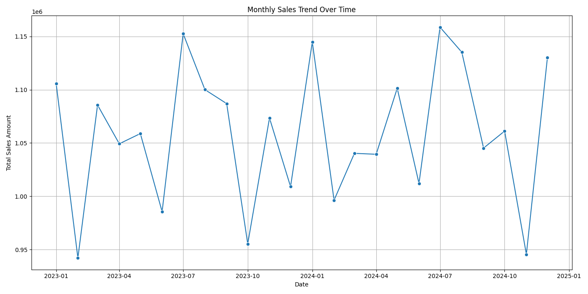
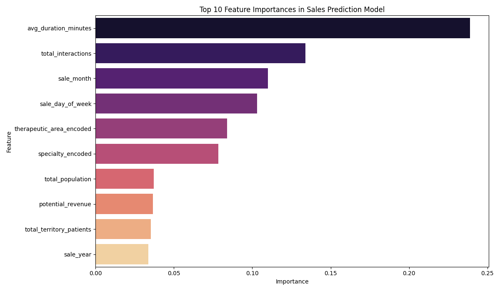
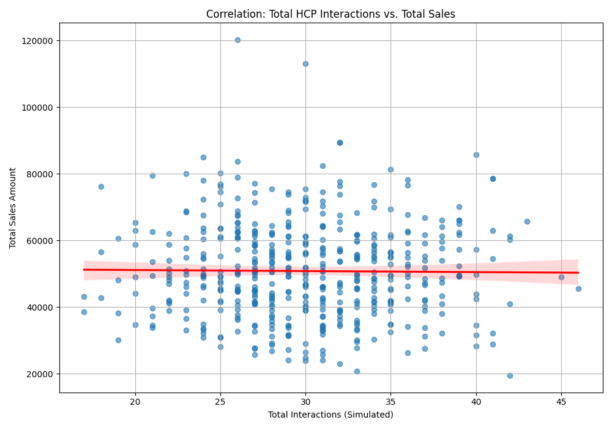
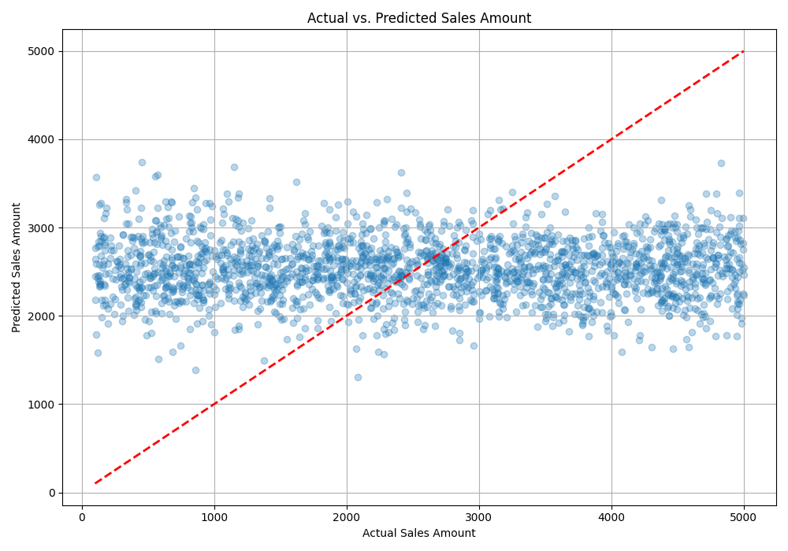

# Pharmaceutical Sales Analytics & Territory Optimization

## Project Overview
This project demonstrates a comprehensive approach to pharmaceutical sales analytics and territory optimization, leveraging SQL for data management and Python (Pandas, NumPy, Scikit-learn, Matplotlib, Seaborn) for data simulation, advanced analysis, and predictive modeling. The goal is to provide data-driven insights to a hypothetical pharmaceutical company  to enhance sales strategy and resource allocation.

## Problem Statement
Pharmaceutical companies face challenges in efficiently allocating sales territories and predicting sales performance due to complex factors like diverse patient populations, varying healthcare professional (HCP) engagement levels, and product-specific market dynamics. Suboptimal territory design can lead to missed sales opportunities and inefficient resource utilization.

## Objectives
* Design and implement a relational database schema in MySQL to store simulated pharmaceutical sales, HCP, and patient journey data.
* Develop a Python script to simulate realistic transactional and master data for the pharmaceutical domain.
* Perform in-depth Exploratory Data Analysis (EDA) to uncover trends, patterns, and key drivers of sales performance.
* Build a predictive model to forecast sales amounts based on various influencing factors (e.g., territory characteristics, HCP engagement, patient demographics).
* Derive actionable business insights and recommendations for optimizing sales territory allocation and improving sales force effectiveness.

## Tools and Technologies
* **Database:** MySQL
* **Programming Language:** Python 3.x
* **Python Libraries:**
    * `pandas`: Data manipulation and analysis
    * `numpy`: Numerical operations
    * `faker`: Realistic data generation
    * `mysql-connector-python`: MySQL database connectivity
    * `scikit-learn`: Machine learning (RandomForestRegressor, train_test_split, metrics)
    * `matplotlib`: Data visualization
    * `seaborn`: Enhanced data visualization

## Data Model
The MySQL database `proc_dna_pharma_analytics` consists of the following tables:
* `Products`: Details of pharmaceutical products.
* `Territories`: Sales territory definitions, including demographics and potential revenue.
* `Sales_Reps`: Information about sales representatives.
* `HCPs`: Healthcare Professional details, linked to territories.
* `Sales_Data`: Transactional sales records, linking products, reps, territories, and HCPs.
* `HCP_Interactions`: Records of sales rep interactions with HCPs.
* `Patient_Demographics`: Aggregated patient population data per territory and disease segment.
* `Patient_Journey_Milestones`: Average times for key patient journey milestones and their impact.

*(Optional: You could add a simple ERD diagram here if you know how to generate one.)*

## Key Analysis & Insights
The project identified several key insights:
* **Sales Trends:** Visualized monthly sales trends, revealing seasonality or growth patterns.
* **Therapeutic Area Performance:** Analyzed sales distribution across different therapeutic areas, highlighting top-performing product categories.
* **HCP Engagement Impact:** Explored the correlation between the number of HCP interactions and total sales attributed to those HCPs, suggesting the importance of consistent engagement.
* **Sales Rep Performance:** Ranked sales representatives based on total sales and other metrics.
* **Territory Performance Drivers:** Initial analysis revealed how factors like `total_population`, `target_patient_population`, and `potential_revenue` (simulated) influence sales.

## Predictive Model
A `RandomForestRegressor` model was trained to predict `sale_amount`.
* **Features Used:** `sale_month`, `sale_quarter`, `sale_day_of_week`, `sale_year`, `total_population`, `target_patient_population`, `potential_revenue`, `total_interactions`, `avg_duration_minutes`, `total_territory_patients`, `avg_territory_treatment_cost`, `therapeutic_area_encoded`, `geographic_area_encoded`, `specialty_encoded`.
* **Model Performance:**
    * Mean Squared Error (MSE): [Insert MSE value from your run]
    * Root Mean Squared Error (RMSE): [Insert RMSE value from your run]
    * R-squared (R2): [Insert R2 value from your run]
* **Feature Importance:** The model highlighted `potential_revenue`, `total_population`, and `total_interactions` as some of the most influential features in predicting sales.

*(After running `analysis_and_modeling.py`, save the plots into `visualizations/` and then update these links with your actual image paths.)*
Example:






## Recommendations
Based on the analysis and predictive insights, potential recommendations for ProcDNA could include:
* **Strategic Territory Realignment:** Reallocate sales resources to territories with high `potential_revenue` and `target_patient_population` but currently lower `sale_amount`.
* **Targeted HCP Engagement:** Focus sales rep efforts on HCPs with higher interaction counts, as these show a positive correlation with sales.
* **Product Focus:** Prioritize sales efforts on products within high-performing therapeutic areas.
* **Patient Journey Optimization:** Invest in initiatives that shorten the `average_days_to_milestone` for critical patient journey steps in underperforming segments.

## How to Run the Project
1.  **Clone the Repository:** (You're doing the initial push, so this is for others)
    ```bash
    git clone [https://github.com/YourGitHubUsername/Pharma_Sales_Analytics_Optimization.git](https://github.com/YourGitHubUsername/Pharma_Sales_Analytics_Optimization.git)
    cd Pharma_Sales_Analytics_Optimization
    ```
2.  **Set up MySQL Database:**
    * Ensure MySQL server is running.
    * Create a user with appropriate permissions.
    * Open your MySQL client (Workbench, command line, etc.) and run the SQL script:
        ```bash
        SOURCE sql/create_tables.sql;
        ```
        (Or copy-paste the content of `create_tables.sql` and execute).
3.  **Install Python Dependencies:**
    ```bash
    pip install -r requirements.txt
    ```
4.  **Configure Database Credentials:**
    * Open `src/data_simulation.py` and `src/analysis_and_modeling.py`.
    * Update the `DB_CONFIG` dictionary with your MySQL `user` and `password`.
5.  **Simulate and Insert Data:**
    ```bash
    python src/data_simulation.py
    ```
    This will populate your MySQL database.
6.  **Run Analysis and Modeling:**
    ```bash
    python src/analysis_and_modeling.py
    ```
    This script will fetch data, perform analysis, train the model, and display plots. **Remember to save the generated plots (e.g., right-click on the plot window and "Save Figure As...") into the `visualizations/` folder before pushing to GitHub.**

## Future Enhancements
* Implement more advanced machine learning models (e.g., XGBoost, LightGBM) for improved prediction accuracy.
* Integrate time series forecasting to predict future sales trends more accurately.
* Develop an interactive dashboard using Streamlit or Plotly Dash to visualize insights dynamically.
* Incorporate more complex patient journey data and simulate patient-level records.
* Explore geospatial analysis to optimize territory boundaries visually.

## Contact
[Jasper Bhardwaj]  - [jaswhid2020@gmail.com]
